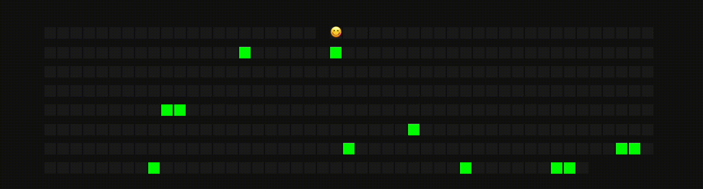

# GitHub Pacman Contributions Game 🕹️

A fun animated project where Pacman eats your GitHub contributions on a grid — Inspired by the classic retro arcade game and the GitHub contribution graph.

This project visualizes your GitHub contribution graph as a grid and animates a Pacman character moving through it, gobbling up the cells where you made commits. Once it finishes, the grid resets and starts again — forever hungry.



---

## 🚀 Live Demo

---

## 🚀 Features

- 🔄 Loops through your contribution graph endlessly
- 🟨 Pacman skips empty squares, munches only green ones
- 🎨 Fully animated using CSS & JavaScript
- 🧠 Uses GitHub GraphQL API for live data

---

## 📦 Tech Stack

- ⚡ [Vite](https://vitejs.dev/) – blazing fast frontend dev tool
- 🧩 Vanilla JavaScript + CSS
- 🔐 GitHub GraphQL API v4
- 💾 dotenv for environment management

---

## 🛠️ Setup Instructions

```bash
git clone https://github.com/Pranam2002/Pacman.git
cd Pacman
npm install
cp .env.example .env
npm run dev
